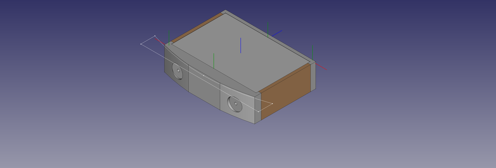

# AmpBox_Gold

An enclosure for a mid-size amplifier, internal dimensions 34x21x10cm(w/d/h). Front, back and sides made of wood, top plate 4mm aluminium sheet, no bottom.

Used mostly to teach myself FreeCAD, so lots of stuff that can be improved. Uses Assembly 4 to bring together the different parts.

